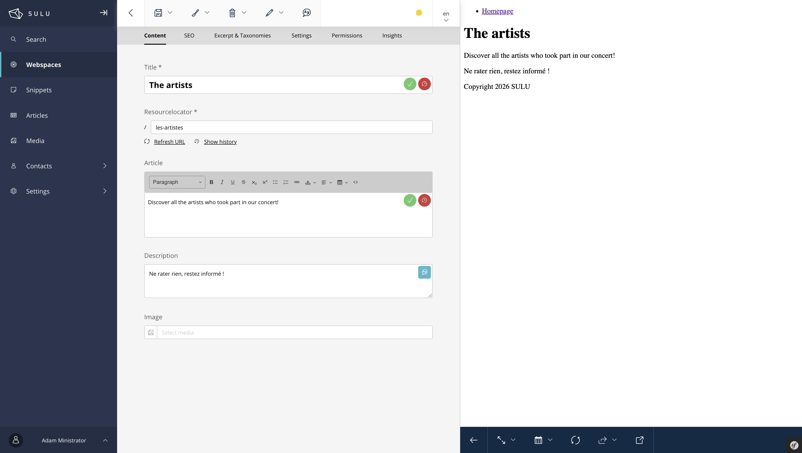
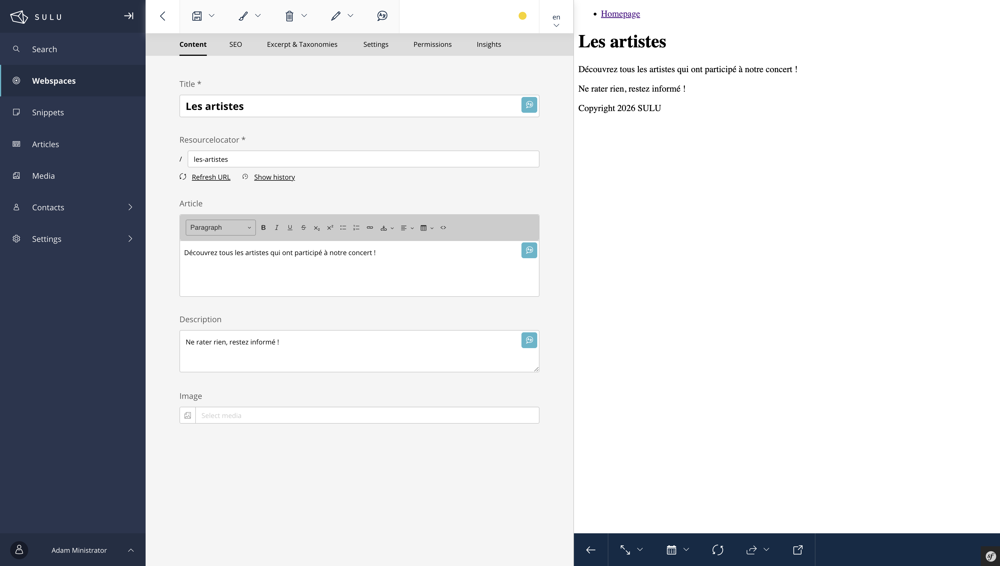
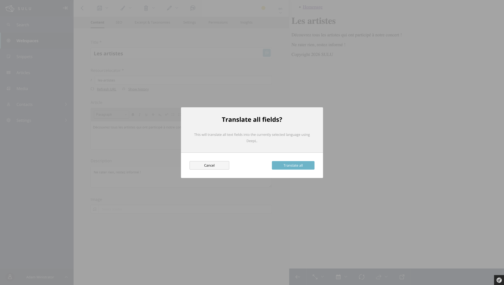
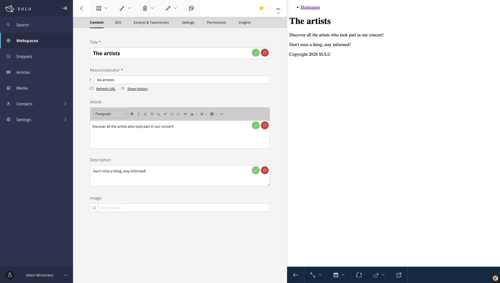
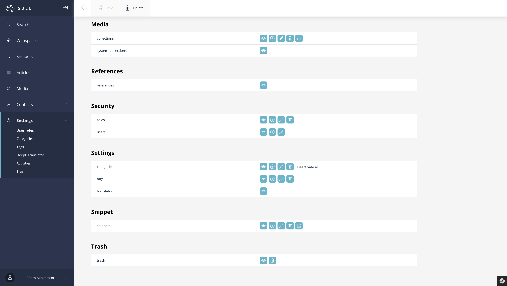

<div align="center">
    
</div>

<h1 align="center">Translator Bundle for <a href="https://sulu.io" target="_blank">Sulu</a></h1>

<h3 align="center">Developed by <a href="https://github.com/steeven-th" target="_blank">Steeven THOMAS</a></h3>
<p align="center">
    <a href="LICENSE" target="_blank">
        
    </a>
    <a href="https://sulu.io/" target="_blank">
        
    </a>
</p>

SuluTranslatorBundle integrates [DeepL](https://www.deepl.com/) automatic translation into the Sulu CMS 3.x admin interface. Translate your page and article content with a single click, directly from the edit form.

## 📂 Requirements

* PHP ^8.2
* Sulu ^3.0
* A [DeepL API key](https://www.deepl.com/pro-api) (Free or Pro)

## 🛠️ Features

* **Per-field translation button** on `text_line`, `text_area` and `text_editor` fields
* **Bulk "Translate all" button** in the form toolbar to translate every text field at once
* **Auto-detection** of the source language by DeepL
* **Target language** automatically set to the locale selected in the admin dropdown
* **Undo button** to revert a translation to the previous value
* **HTML preservation** for rich text fields (CKEditor content)
* **DeepL usage statistics** page in admin settings (account type, billing period, character usage)
* **Permission-based access** to the statistics page via Sulu role system
* **Pages and articles** support

## 🇬🇧 Available translations

* English
* French
* German

## 📦 Dependencies

* [Deepl PHP](https://github.com/DeepLcom/deepl-php)

## 📝 Installation

### Composer

```bash
composer require itech-world/sulu-translator-bundle
```

### Symfony Flex

If you don't use Symfony Flex, you can add the bundle to your `config/bundles.php` file:

```php
return [
    // ...
    ItechWorld\SuluTranslatorBundle\ItechWorldSuluTranslatorBundle::class => ['all' => true],
];
```

### Configuration

#### Step 1: Configure your DeepL API key

Add your DeepL API key to your `.env` or `.env.local` file:

```dotenv
DEEPL_API_KEY=your_deepl_api_key_here
```

#### Step 2: Create the bundle configuration

Create the file `config/packages/itech_world_sulu_translator.yaml`:

```yaml
itech_world_sulu_translator:
    deepl_api_key: "%env(DEEPL_API_KEY)%"
    locale_mapping:
        en: "en-GB"
        fr: "fr"
        de: "de"
```

> **Note:** The `locale_mapping` is optional. It maps Sulu locale codes to DeepL language codes. If a locale is not mapped, it will be converted to uppercase automatically (e.g. `fr` becomes `FR`). See [DeepL supported languages](https://developers.deepl.com/docs/resources/supported-languages) for valid codes.

#### Step 3: Register the admin JavaScript

Edit the `assets/admin/app.js` to add the bundle in imports:

```javascript
import 'sulu-itech-world-sulu-translator-bundle';
```

#### Step 4: ***BACK*** & Build admin assets

Edit the `assets/admin/package.json` to add the bundle to the list of bundles:
```json
{
    "dependencies": {
        // ...
      "sulu-itech-world-sulu-translator-bundle": "file:../../vendor/itech-world/sulu-translator-bundle",
    }
}
```

In the `assets/admin/` folder, run the following command:

```bash
npm install
npm run build
```

or

```bash
yarn install
yarn build
```

#### Step 5: Clear cache

```bash
php bin/adminconsole cache:clear
```

## 🔤 Per-field Translation

Once installed, a **translate button** (language icon) appears on every `text_line`, `text_area` and `text_editor` field in the page and article edit forms.

1. Select the **target language** in the Sulu locale dropdown (top of the page)
2. Click the **translate button** on any field
3. The field content is sent to DeepL and replaced with the translation
4. A **green checkmark** confirms the translation, and a **red undo button** appears next to it to revert to the original value

After translating individual fields, the green checkmark and red undo button are shown side by side:



## 🌍 Bulk Translation

A **"Translate all"** button is available in the form toolbar:

1. Select the target language in the locale dropdown
2. Click **"Translate all"** in the toolbar
3. Confirm the action in the dialog
4. All text fields are translated simultaneously







## 📊 DeepL Usage Statistics

The bundle provides a settings view accessible under **Settings > DeepL Translator**, showing your DeepL API usage:

- **Account type** badge (Free or Pro)
- **Billing period** dates (Pro accounts only)
- **Characters used** vs. plan limit with a visual progress bar (green / yellow / red)
- **Refresh** button and direct link to your DeepL dashboard


### Permissions

Access to the statistics page is controlled by the Sulu permission system. A **"translator"** entry appears under **Settings** in the role permissions. Enable the **View** permission to grant access.



## 📋 Supported Field Types

| Sulu Field Type | Support | Notes                                                                                      |
|-----------------|---------|--------------------------------------------------------------------------------------------|
| `text_line` | ✅ | [Single-line text input](https://docs.sulu.io/3.x/reference/property-types/text_line.html) |
| `text_area` | ✅ | [Multi-line text area](https://docs.sulu.io/3.x/reference/property-types/text_area.html)                                                                   |
| `text_editor` | ✅ | [Rich text](https://docs.sulu.io/3.x/reference/property-types/text_editor.html)                                                                              |

## 🔌 REST API Endpoints

The bundle exposes two admin API endpoints:

| Method | Endpoint | Description |
|--------|----------|-------------|
| `POST` | `/admin/api/translator/translate` | Translate text content |
| `GET` | `/admin/api/translator/usage` | Get DeepL API usage stats |

### POST /admin/api/translator/translate

**Request body:**

```json
{
    "text": "Bonjour le monde",
    "target": "en",
    "source": "fr",
    "html": false
}
```

| Field | Type | Required | Description |
|-------|------|----------|-------------|
| `text` | string | Yes | Text content to translate |
| `target` | string | Yes | Target Sulu locale code |
| `source` | string | No | Source language (auto-detected if omitted) |
| `html` | boolean | No | Set to `true` for rich text fields to preserve HTML markup |

**Response:**

```json
{
    "translation": "Hello world"
}
```

### GET /admin/api/translator/usage

**Response:**

```json
{
    "character_count": 42500,
    "character_limit": 500000,
    "account_type": "free",
    "start_time": null,
    "end_time": null
}
```

> **Note:** `start_time` and `end_time` are only returned for Pro accounts. Free accounts will receive `null` for these fields.

## 🐛 Bug and Idea

See the [open issues](https://github.com/steeven-th/SuluTranslatorBundle/issues) for a list of proposed features (and known issues).

## 💰 Support me

You can buy me a coffee to support me **this plugin is 100% free**.

[Buy me a coffee](https://www.buymeacoffee.com/steeven.th)

## 👨‍💻 Contact

<a href="https://steeven-th.dev"></a>
<a href="https://x.com/ThomasSteeven2"></a>
<a href="https://www.linkedin.com/in/steeven-thomas-221b02b8/"></a>

## 📘&nbsp; License

This bundle is under the [MIT License](LICENSE).
